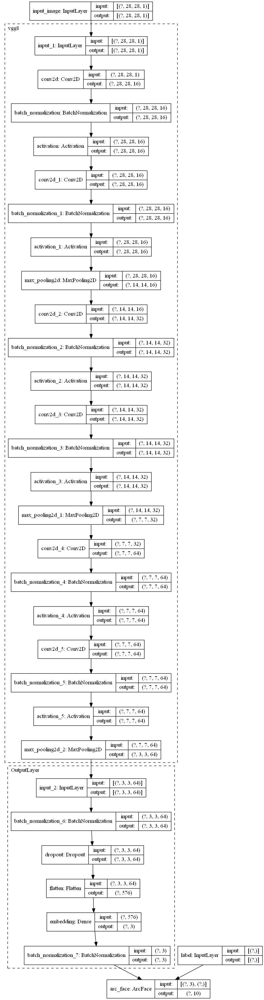
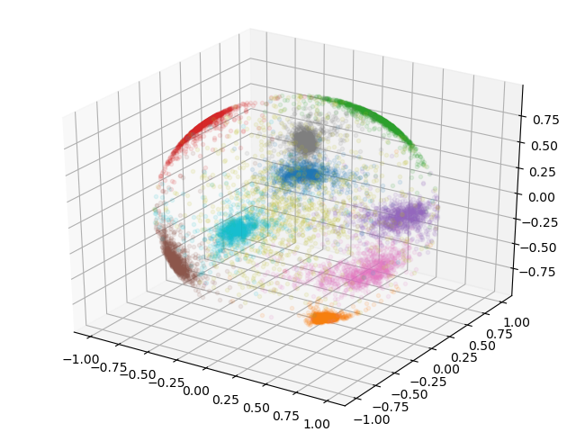
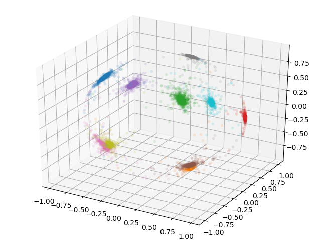

# ArcFace-TensorFlow 2.0
Tensorflow2.0 implementation of ArcFace.

---  

## Requirements
- tensorflow 2.0
- python 3
- numpy
- For plot
  - matplotlib

---

## Model
### MNIST resolution is very small.so I use VGG8 backbone model.
<center></center>

---

## Documentation
### Download Dataset
MNIST dataset will be downloaded automatically.
```
(train_images, train_labels), (_, _) = tf.keras.datasets.mnist.load_data()
```

### Training ArcFace
Use `train_net_mnist.py` to train a ArcFace network.

---

## Results
### epoch = 10
#### Softmax
<center></center>

#### ArcFace
<center></center>

---

## Reference
 [Jiankang Deng. *ArcFace: Additive Angular Margin Loss for Deep Face Recognition*, CVPR2019.](https://arxiv.org/abs/1801.07698)